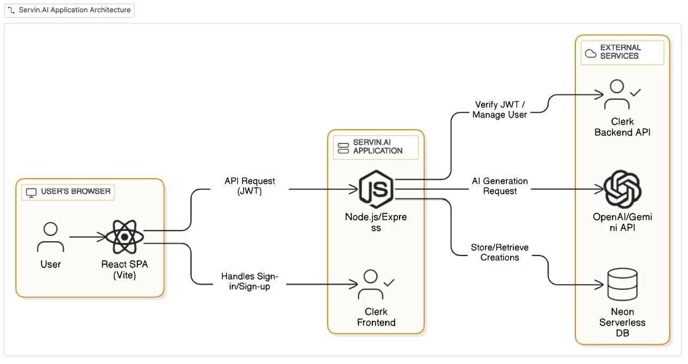

<p align="center">

</p>

Servin.AI is an open-source web application designed to provide a suite of AI-powered tools and features for users and developers. The project aims to deliver a modern, user-friendly experience with a focus on accessibility, performance, and scalability.

## ✨ Features

  - **AI Article Writer:** Generate high-quality, engaging articles on any topic.
  - **Blog Title Generator:** Create catchy and effective titles for your blog posts.
  - **AI Image Generation:** Produce stunning visuals from textual descriptions.
  - **Background Removal:** Effortlessly remove backgrounds from your images.
  - **Object Removal:** Seamlessly remove unwanted objects from your images.
  - **Resume Reviewer:** Get your resume reviewed by AI to improve your chances of landing your dream job.
  - **Community Page:** Share and discover AI-generated content from the community.
  - **User Dashboard:** Manage your creations and account settings.
  - **Responsive Design:** A fully responsive and intuitive user interface built with React and Vite.

##  Technologies Used

**Client-Side:**

  - **React:** A JavaScript library for building user interfaces.
  - **Vite:** A fast build tool and development server.
  - **Tailwind CSS:** A utility-first CSS framework.
  - **Clerk:** for user authentication and management.
  - **Lucide React:** A library of simply designed icons.
  - **React Router DOM:** for routing and navigation.

**Server-Side:**

  - **Node.js:** A JavaScript runtime environment.
  - **Express:** A web application framework for Node.js.
  - **OpenAI:** for AI-powered features.
  - **Neon:** A serverless Postgres database.
  - **Clerk:** for backend authentication.

## Application Architecture 

<p align="center">

</p>


##  Getting Started

To get a local copy up and running, follow these simple steps.

### Prerequisites

  - Node.js (v14 or later)
  - npm

### Installation

1.  Clone the repository:
    ```sh
    git clone https://github.com/your-username/servin.AI.git
    ```
2.  Navigate to the `client` directory:
    ```sh
    cd servin.AI/client
    ```
3.  Install dependencies:
    ```sh
    npm install
    ```
4.  Start the development server:
    ```sh
    npm run dev
    ```

## 📂 Folder Structure

  - `client/src/components/` - Reusable React components
  - `client/src/pages/` - Application pages
  - `client/src/assets/` - Images and static assets
  - `client/public/` - Public files
  - `server/controllers/` - Server-side controllers
  - `server/routes/` - Server-side routes
  - `server/middlewares/` - Server-side middlewares

## 🤝 Contributing

Contributions are what make the open-source community such an amazing place to learn, inspire, and create. Any contributions you make are **greatly appreciated**.

1.  Fork the Project
2.  Create your Feature Branch (`git checkout -b feature/AmazingFeature`)
3.  Commit your Changes (`git commit -m 'Add some AmazingFeature'`)
4.  Push to the Branch (`git push origin feature/AmazingFeature`)
5.  Open a Pull Request

## 📄 License

This project is licensed under the MIT License. See the `LICENSE` file for details.